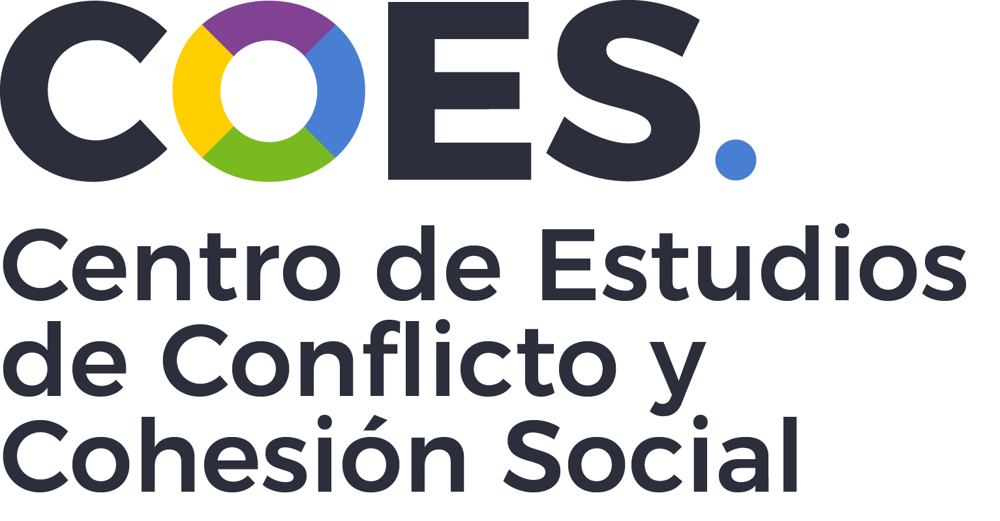
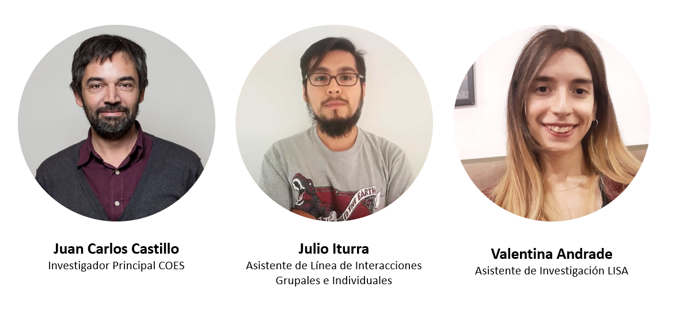
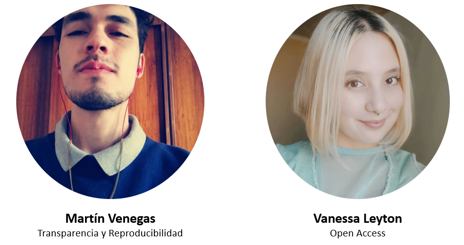
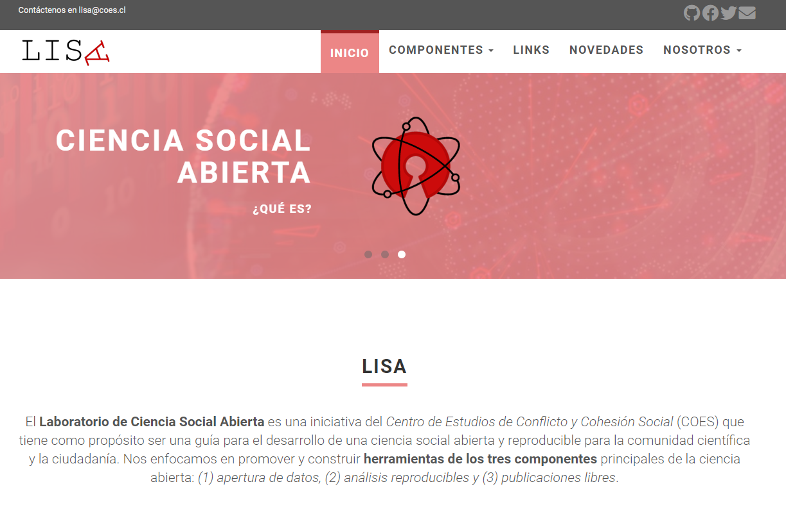
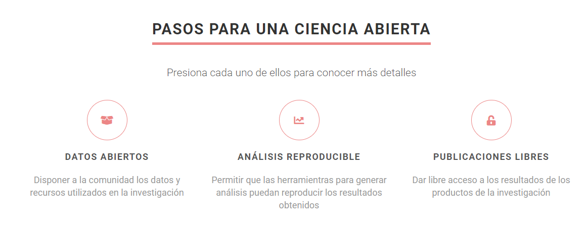

class: middle, inverse

.pull-left[
# Laboratorio de Ciencia Social Abierta

**Julio Iturra Sanhueza**

22 junio 2021
]

.pull-right[

 
 
 

]

---
# Presentación

> El **Laboratorio de Ciencia Social Abierta** es una iniciativa del Centro de Estudios de Conflicto y Cohesión Social (COES) que tiene como propósito ser una guía para el desarrollo de una ciencia social abierta y reproducible para la comunidad científica y la ciudadanía. Nos enfocamos en promover y construir **herramientas de los tres componentes** principales de la ciencia abierta: (1) apertura de datos, (2) análisis reproducibles y (3) publicaciones libres.

 
 
 
.center[]

---
# Equipo

---

# Pasantes

.center[

]

---
class: inverse, middle, center
# Desarrollo sitio web

---
class: center

[https://lisa-coes.netlify.app/](https://lisa-coes.netlify.app/)

**Desarrollado por Valentina Andrade de LISA**
---
# Componentes 
.center[

]

---
# Datos Abiertos

.pull-left[
## Guía para la apertura de Datos
  * Paso 1: ¿Qué es lo que necesito?
  * Paso 2: ¿Cómo darle en un formato aceptable?
    1. Bases de Datos
    2. Cuestionario
    3. Libro de códigos
      * Guía: [¿Cómo hacer un libro de códigos?](https://lisa-coes.netlify.app/como-hacer-codebook/)
  * Paso 3 : ¿Cómo publicar? (Video)
]  

.pull-right[
<iframe width="560" height="315" src="https://www.youtube.com/embed/kFhxs-EfUqA" title="YouTube video player" frameborder="0" allow="accelerometer; autoplay; clipboard-write; encrypted-media; gyroscope; picture-in-picture" allowfullscreen></iframe>
]

---
# Trabajo en proceso

Desarrollo de los siguientes componentes:

* Transparencia y Reproducibilidad
* Publicaciones Libres

---
class: center, middle

Presentación creada via la librería de R [**xaringan**](https://github.com/yihui/xaringan).

