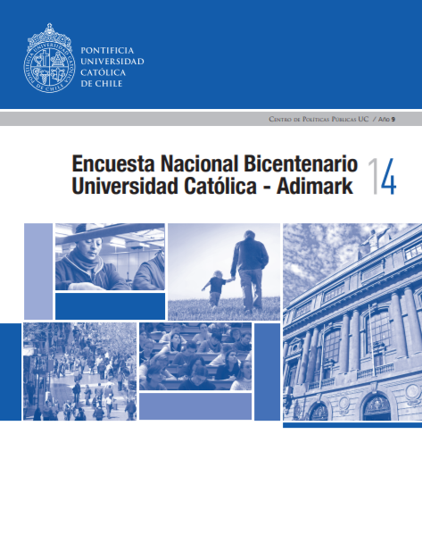
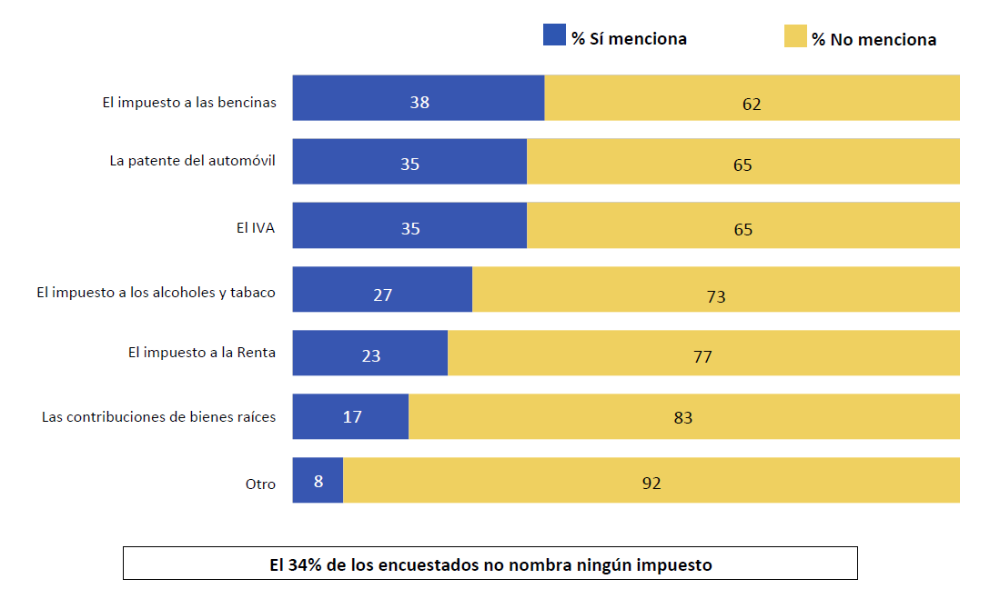

layout: true
class: animated, fadeIn

---
class: slideInRight, center, middle

# Antecedentes

---

.left-column[
  

]

.right-column[

## En América Latina

 1. Impuestos y Administración
 2. Reforma Tributaria
 3. Inversiones Públicas
 4. Opinión Pública

> Sandino (2013) Cultura Tributaria en Nicaragüa: percepciones y valoraciones de los nicaragüences sobre los impuestos 2011 - 2012. / Adelmo Sandino. - 1a ed - 

]


---
.left-column[
 
] 

.right-column[
## En Chile 

1. La encuesta da cuenta de una baja conciencia tributaria entre los chilenos. 

2. Un importante desafío para la autoridad plantea el alto porcentaje de quienes consideran que los recursos
recaudados son mal utilizados por el Estado.


> Encuesta Nacional Bicentenario Universidad Católica - Adimark (2014). Centro de Política Públicas UC, Año 9.

]

---

_**¿Podría nombrarme los impuestos que paga usted (y su familia) en un año normal?**_ 

.center[
 
]

.right[.small[Fuente: Encuesta Nacional Bicentenario UC 2014]]

---
class: middle, center

# Diseño Encuesta


---
# Objetivos de la Encuesta

### 1. **Identificar** y **comprender** los niveles de _conocimiento_ y _moral tributaria_ en la sociedad chilena, estableciendo comparaciones entre clases sociales, y considerando al sistema tributario en general como también a sus principales impuestos en específico.

### 2. Recoger datos sobre las **percepciones** y **creencias** de las personas en Chile en torno a los impuestos y la redistribución económica, así como también sobre otros temas sociales y políticos relevantes para el contexto nacional.

---
class: middle, center

# Módulos principales

---
background-image: url(images/modulos1.png) 
background-size: contain

---
background-image: url(images/modulos2.png) 
background-size: contain

---
background-image: url(images/modulos3.png) 
background-size: contain

---
background-image: url(images/elabcues.png) 
background-size: contain

# Proceso elaboración cuestionario
---
# Diseño Encuesta

```{r echo=FALSE, results='asis'}
library(readxl)
library(knitr)
table01 <- read_excel("images/table01.xlsx")
kable(table01,format = "html")
```

---

# Hoy

### 1. Proceso de licitación pública (10 a 24 enero)
### 2. Trabajo de cuestionario
### 3. Estrategia para divulgación de resultados:

### .center[**https://nuestrosimpuestos.cl/**]

### 4. Proceso abierto en GitHub:

### .center[**https://jciturras.github.io/taxes/**]


---
class:middle, center

# ¡Gracias!
## julioiturrasanhueza@gmail.com
### https://nuestrosimpuestos.cl/  

---
class: center, middle

# _Encuesta de Conocimiento y Moral Tributaria de Chile._

---
class: center, middle

Slides created via the R package [**xaringan**](https://github.com/yihui/xaringan).

The chakra comes from [remark.js](https://remarkjs.com), [**knitr**](http://yihui.name/knitr), and [R Markdown](https://rmarkdown.rstudio.com).


